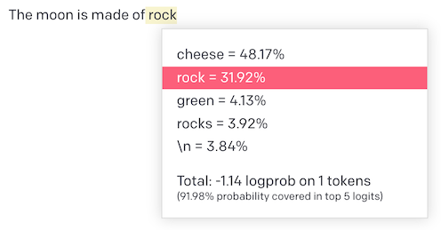

+++
title = "The Moon is made of Cheese"
subtitle = "The Importance of Multiple Tests in Evaluating LLMs"
date = "2023-06-05T12:00:00-08:00"
[taxonomies]
tags = ["OpenAI", "ChatGPT", "LLMs"]
+++

Before we dive into the world of LLMs, let's take a moment to appreciate the absurdity of a world
where the Moon is actually made of cheese. Imagine the cosmic fondue parties we could have!

Recently, there has been a surge in articles questioning the usefulness of large language models
(LLMs) like GPT-3.5 for certain tasks. These articles often base their conclusions on single
experiments, which can be misleading due to the inherent randomness in LLMs' outputs. In this blog
post, we will discuss the importance of conducting multiple tests and considering the probabilities
of different completions when evaluating the performance of LLMs.

<!-- more -->

To illustrate the issue of misinterpretation, let's ask GPT 3.5 to complete the phrase "The Moon is
made of." By using the completion API in the playground with the `text-davinci-003` model, limiting
the output to one token, and revealing the probabilities, we can observe the variability in the
results.

The completion models of GPT can display the probabilities for each word in a completion, which is a
great way to demonstrate why relying on just one experiment can be misleading when evaluating these
models. The screenshot shows that around 48% of the time, the model completes the sentence with the
word "cheese", while just 32% of the time it will complete the sentence with the word "rock. Add in
the 4% of the time that the completions is Green (which completes with "cheese" 99% of the time),
and you have more than half the completions of that sentence incorrectly suggesting we should send
an expedition of Ritz Cracker (Jatz for my antipodean friends) wielding astronauts up there to bring
back that yellow gold.

While the above example showed a place where the more frequent outcome (Cheese) was incorrect, it's
also possible to see this problem with outcomes that incorrect as well. Take the query "The
president in 2017 was", which returns "Donald" 76% of the time and "Barack" 17% of the time, likely
due to Trump's inauguration on January 20th.

Every word in the output can have this sort of problem. This isn't exactly controversial; it's
simply how LLMs work. However, it does show that drawing conclusions from a single conversation
without multiple tests can be misleading.

To carry out more accurate experiments, you can use the playground and API tools to tweak settings
like temperature and top p, which influence the output's "spiciness". Remember, a little 'spiciness'
can be fun, but too much can leave you reaching for a glass of milk to cool down. The same goes for
LLM outputs. However, these options aren't available in the ChatGPT web UI that most users access,
emphasizing the importance of multiple tests. Check out the [OpenAI API docs] for more information.

[OpenAI API docs]: https://platform.openai.com/docs/api-reference/completions/create#completions/create-temperature

The Chat oriented models tend to return the correct result for the moon prompt, but in general this
problem still presents often. Unfortunately the Chat versions of the models in the API do not show
the probabilities of words to be able to give a good example of this.

When assessing the performance of ChatGPT or other LLMs, it's essential to remember that their
outputs can be random, so conducting multiple tests gives a better understanding of their true
abilities. Trusting single experiments can lead to wrong conclusions and weaken the analysis. So,
whether you're reading or writing about LLMs, always double-check the experiments and make sure that
several tests back up any claims made.

In conclusion, don't let your evaluation of LLMs be eclipsed by a single test – multiple tests are
the key to a well-rounded understanding.
